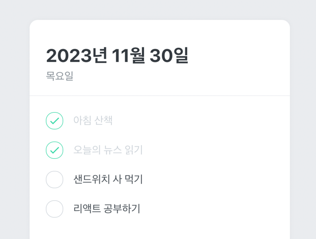

# React 로 구현하는 To-do List

> 벨로퍼트님의 리액트 프로젝트를 참고하였습니다

## 🚀 목표
- 리액트 프로젝트 구조 익히기
  - 폴더 구조
  - 파일 내 컴포넌트 구성 방식
  - 파일(또는 객체) 분리 기준
- styled-component 를 통한 컴포넌트 스타일링
- Context API 를 사용한 전역 상태 관리

## ✨ 구현 기능
- [x] 오늘 날짜의 투두 리스트 조회
- [x] 투두 리스트 체크 및 체크 취소
- [x] 투두 리스트 생성
- [x] 투두 리스트 제거

## 추가 기능
- [ ] 테마 색상 변경
  - [ ] 지정되어 있는 색상으로 변경
  - [ ] 입력창으로 받은 색상으로 변경
- [ ] 오늘의 날씨 조회

## 📑 참고 사이트
- [벨로퍼트와 함께하는 모던 리액트 - 멋진 투두리스트 만들기](https://react.vlpt.us/mashup-todolist/)
